# Objective:
The objective of the project is to extract meaningful insights and actionable information from
the sales data in order to improve decision-making, identify trends, and optimize sales
performance. The project aims to present the data in easy-to-analyse interactive dashboards that
will allow users to quickly grasp key insights and make appropriate decisions.

# Tools:
Microsoft Excel

# Dataset:
The dataset was found on Kaggle and shows sales data of a shoe store. It presents information
about 1,522 transactions, for each transaction including information such as:
- product (name and category)
- customer (name and gender)
- transaction details (sales date, if order was returned, quantity sold, price, and cost)
- store
- sales representative

The dataset looks as follows:
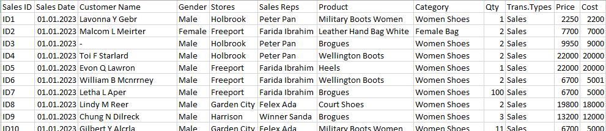

The dataset doesn’t need cleaning, however certain columns need to be added for more detailed analysis:
- Total Sales = Quantity * Price (for a given transaction)
- COGS = Quantity * Cost (for a given transaction)
- Gross Profit = Total Sales – COGS (for a given transaction)
- Month – showing month of a given transaction in numeric form
- Month Name – showing name of the month of a given transaction

Transformed dataset looks as follows:
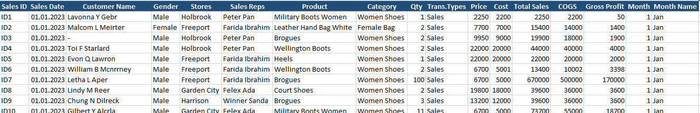

# Key analysis questions:
Before diving into the analysis phase of the project, it is essential to define specific questions
we aim to answer.
With the given dataset, the analysis can be divided into two aspects. The first is the financial
aspect, where the main focus of the analysis is financial data. The second aspect focuses more
on analysis of products.

Key Questions the project addresses:

Financial aspect:
1. What is the overall gross profit?
2. How does the gross profit compare across different products and categories?
3. Which sales representatives contribute the most to the gross profit?
4. Is there a correlation between the quantity sold and the gross profit?

Products aspect:
1. Which products have the highest sales quantity?
2. Which product categories contribute the most to overall sales?
3. Are there any seasonal trends in product sales?
4. How does the quantity of products sold vary across different stores?

# Methodology:
Methodology for this project involves utilizing Microsoft Excel, specifically leveraging pivot
tables, slicers, and graphs, to analyse the sales data. As the dataset is already processed, it is
possible to create pivot tables answering Key Questions. Use of slicers allows for easy and
dynamic data exploration, as it enables users to see specific output based on selected criteria or
filters. Graphs and other visual interpretations are used to present the analysed data.

# Analysis:
The following steps were undertaken to conduct the analysis:
1. Pivot Table Creation:
Pivot tables were created in “Support sheet” to summarize and aggregate the sales data.
One pivot table was also created in “Products Dashboard”. The data was organized into
relevant dimensions, allowing for proper analysis.
2. Graphical Representation:
Graphs and charts were created from the pivot tables to visually showcase trends,
comparisons, and distributions of important sales metrics.
3. Slicer Implementation:
Slicers were implemented to provide interactive filtering options for pivot tables/charts. By
selecting specific criteria, data can be dynamically filtered to explore different dimensions
and segments.
4. Formatting and Presentation:
To enhance the visual appeal and readability of the analysis, formatting techniques were
applied to graphs and slicers. A consistent colour scheme, appropriate fonts, and clear
labelling were employed to ensure a professional and visually engaging presentation of
the findings.

As Key Questions include two aspects, two dashboards were created:

Sales Dashboard

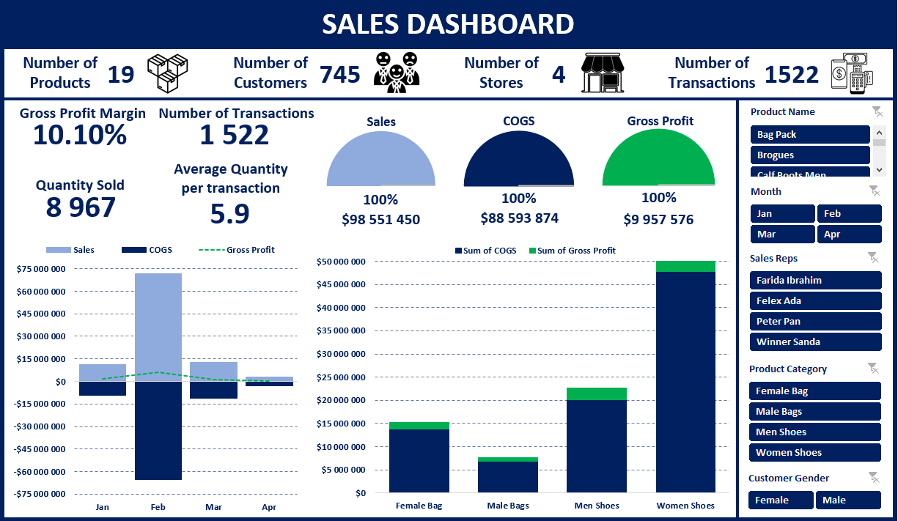

Products Dashboard

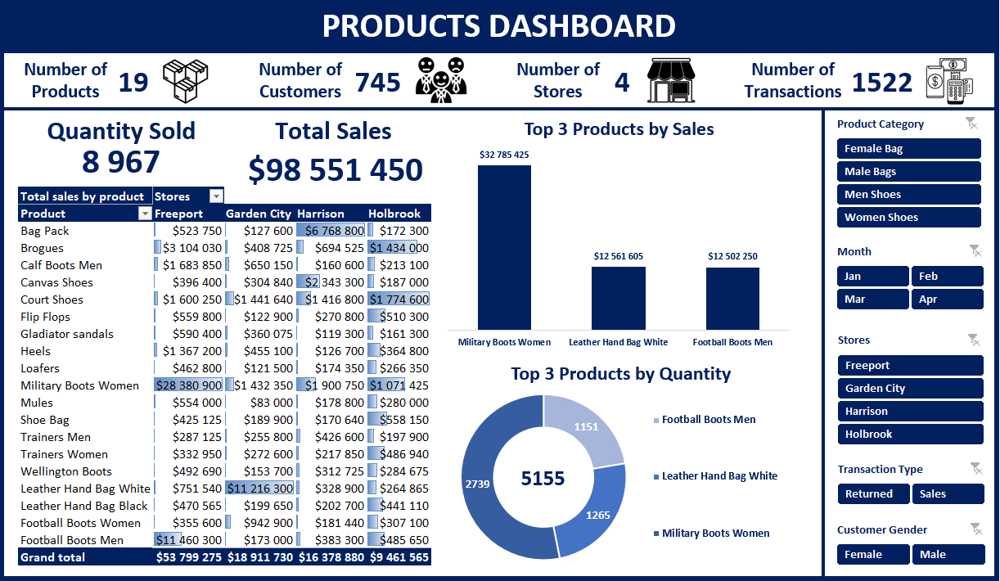

__Based on created dashboards, these are answers to Key Questions:__

__Financial aspect:__
1. An overall gross profit of the company amounts to $9,957,576, with a gross profit margin
of 10.10%.
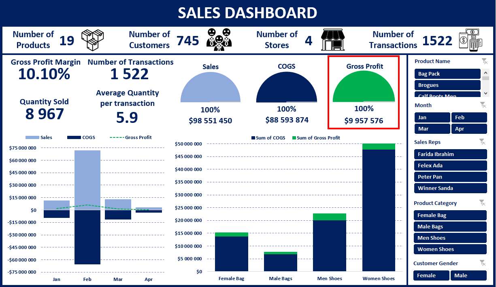

2. The "Women Shoes" category generates the highest gross profit (53% of total) while
"Military Boots Women" is the most profitable individual product (29% of total).
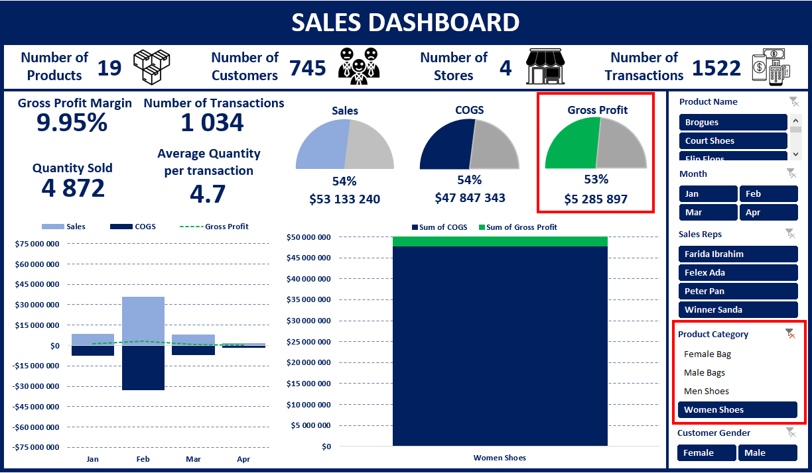
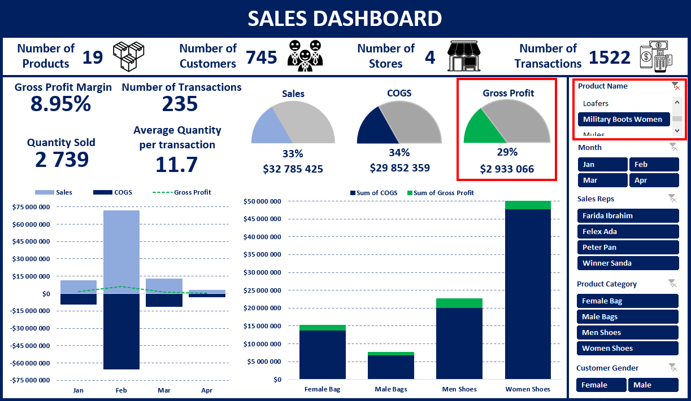

3. Farida Ibrahim is the top contributor to gross profit, accounting for 51% of the total gross
profit.
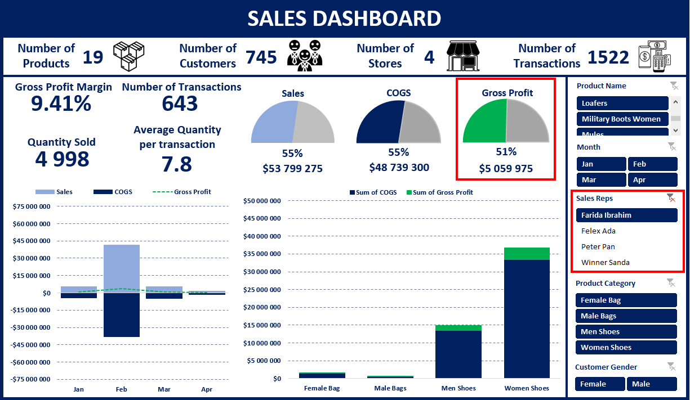

4. In general, there is a positive correlation between the quantity sold and gross profit.
However, it is essential to consider the gross profit margin of each product. Some products,
like "Brogues," have a higher gross profit margin and can contribute more to overall
profitability despite lower sales quantity.
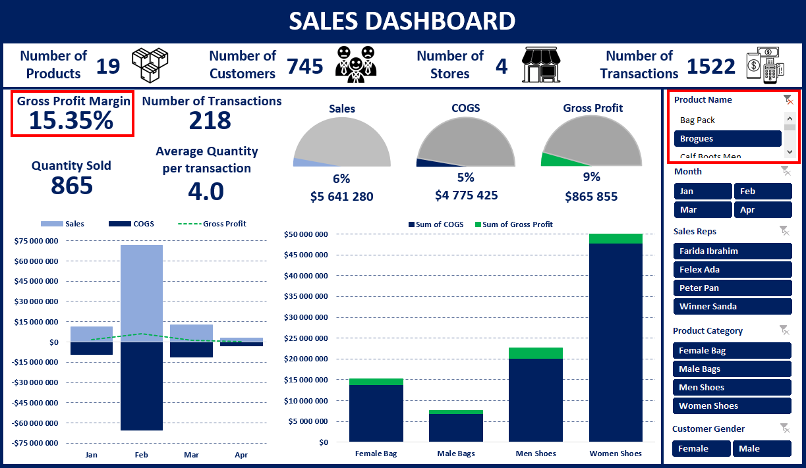   

__Products aspect:__
1. The top three products with the highest sales quantity are "Military Boots Women",
"Leather Hand Bag White", and "Football Boots Men".
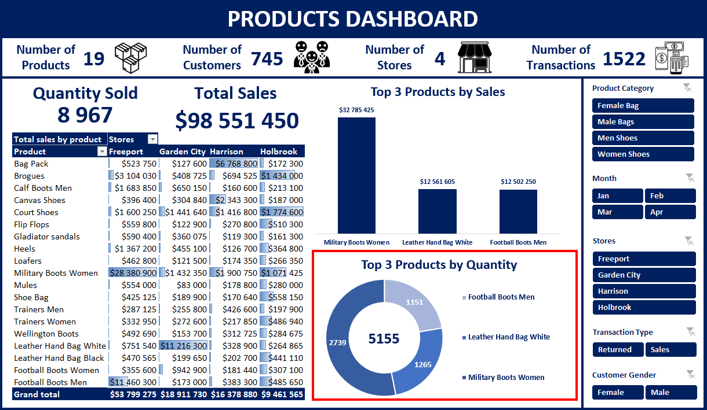

2. The "Women Shoes" category contributes the most to overall sales.
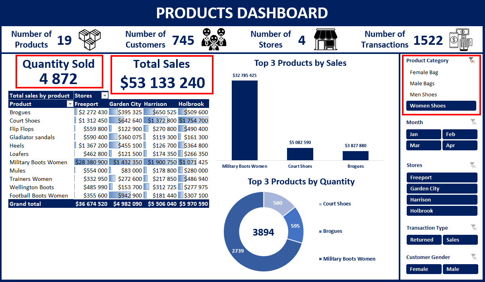

3. Sales data from the available months indicate that February had significantly higher sales,
accounting for 73% of total sales.
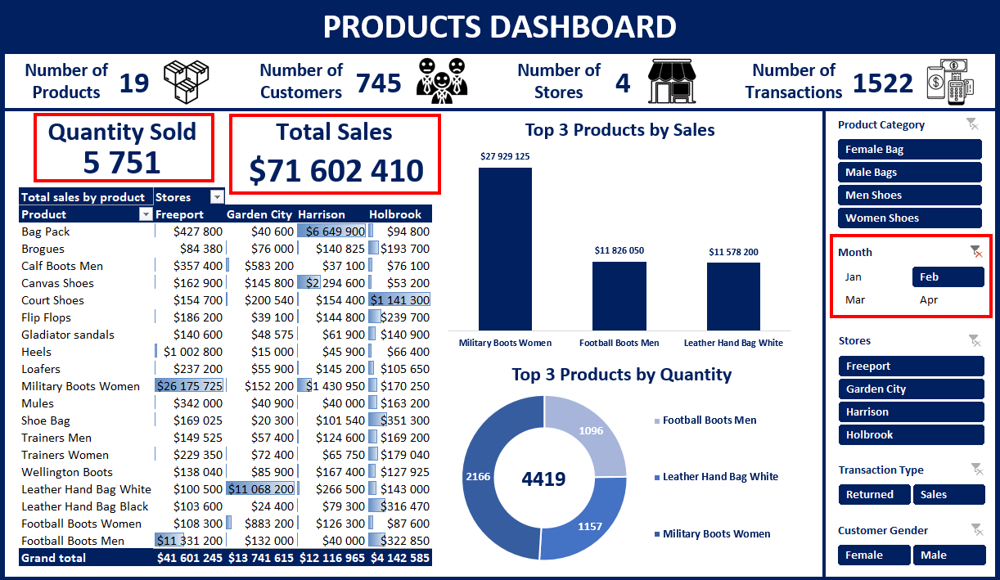
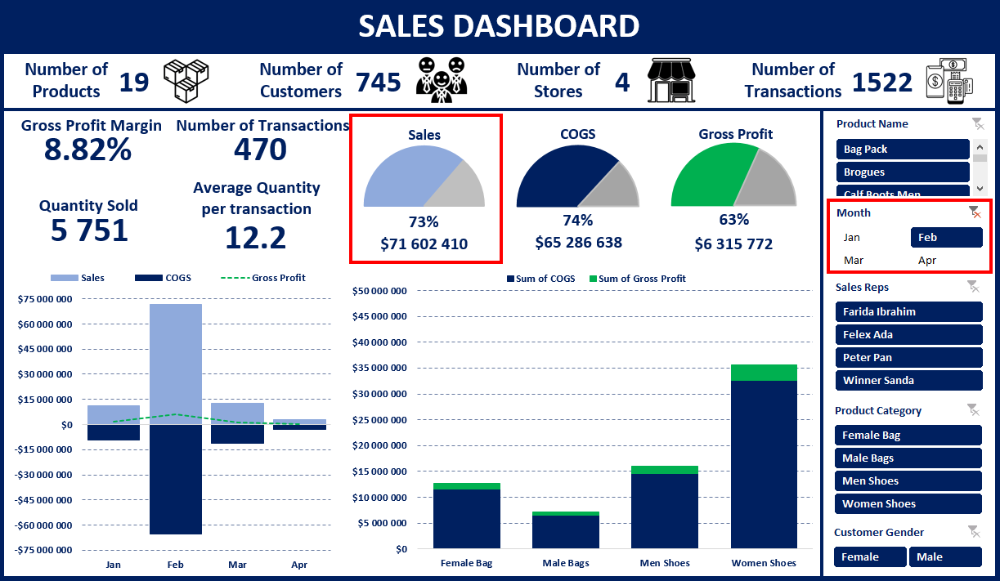

4. The quantity of products sold varies across different stores, with "Freeport" leading with
4,998 units sold. "Garden City" sales amounts to 1,854 units, while "Harrison" and "Holbrook" sales
amount to, respectively, 1,105, and 1,010 units.
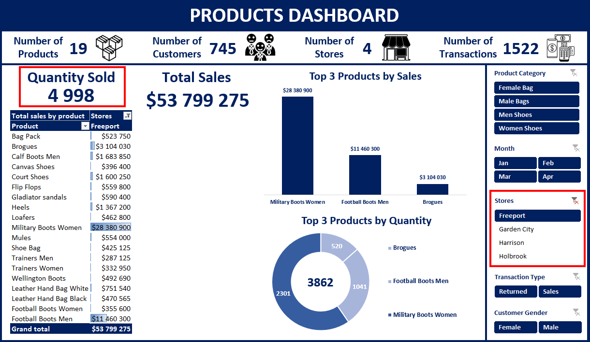

# Conclusions:
After analysing the data, several key insights can be made. The first is that “Women Shoes”
category generates the highest gross profit and contributes the most to overall sales. The best-selling
individual product is “Military Boots Women”, both in terms of quantity and revenue.
Knowing this, the manager may allocate more resources and attention to “Women Shoes”
category. This could include expanding the product range, improving the in-store display, and
implementing targeted marketing strategies to attract more customers specifically interested in
women's shoes.

Farida Ibrahim is a sales representative responsible for generating 51% of total gross profit. The
manager should not only reward him to keep him motivated, but also identify factors
contributing to his success. It may be the case that other employees need a training to catch up
with his performance.

“Freeport” has the highest number of products sold out of all four stores. It’s important to
investigate what could be the cause of it. It can be a matter of location of the stores - the
“Freeport” may be in the city center while the others may be on the outskirts of the city.

Sales in February account for 73% of total revenue and gross profit in February accounts for
63% of total gross profit. Interesting thing is that number of transactions (470) was very close
to those of January (451) and March (443). It means that the higher revenue in February results
from higher quantity of products sold, which amounted to 5,751, giving an average quantity of products
per transaction of 12.2, while in January, March and April this average was, respectively, 3.5, 2.8, and 2.5. 
This anomaly can be an effect of some special offer or a one-off event (for example someone buying
a huge quantity of products in one transaction). This definitely needs to be further investigated.

These insights and recommendations can guide data-driven decision-making processes to
enhance sales strategies, improve financial performance, and drive overall business growth.
